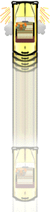

.. _add-skills:

附加技巧
============

这里还有一些额外的招式，你在游戏中可能会用得上。

.. _crazy-turn:

Crazy Turn
----------------

- (from full stop)
- **Turn Wheel Sharply Left or Right > Floor Gas Pedal**

如何触发？
+++++++++++

在你的出租车停稳后：

1. 很快地将方向打到左边或右边。
2. 把油门 (Gas Padel) 踩到底。

如何判断是否正确触发？
++++++++++++++++++++++++

车的前面部分将被锚定在固定的位置，而后半部分将围绕它旋转。（我相信）在你把方向盘转回来或松开油门之前车会一直保持转动（虽然我想像不到你需要转过大于 180 度的情况）。

注意事项
++++++++++++

嗯哼...

- 这个招式在旋转的时候看起来像 :ref:`crazy-tailspin` 一样，但是速度要慢得多，这也就是为什么你最好在接送乘客之前做一个 Crazy Tailspin 而不是在后面加一个 Crazy Turn。

- 踩下油门之前，要猛打方向向左或向右转，这一点很重要。如果你试图同时做这两件事，可能会使车边转弯边向前行驶，而不是仅仅转弯。

- 这个招式最常用的情况就是当你要接一位目的地方向跟你前进方向相反的乘客时。但是，更好的做法是去\ :ref:`loc-idx`\ 研究研究乘客的颜色和模式，来避免这种情况的发生。

- 如果你不知道或者不记得要接的乘客想去哪个地方，最好的选择就是在停车之前 :ref:`crazy-drift` 并/或 Crazy Tailspin 到一个比较“中性”的方向，这样你接到乘客之后就能不浪费太多时间开向任意一个方向。不过最好少用这个办法。

Crazy Backdash
------------------

- (from full stop or very slow speed)
- **Drive > Floor Gas Pedal > Reverse**

如何触发？
+++++++++++

这个招式可以在车静止或缓慢移动时触发。本质上它只是在一次 :ref:`crazy-dash` 之后把挡位换到倒挡。注意，这个招式的流程如下：

1. 把挡位 (gearshift) 从空挡或倒退调到前进 (Drive)。（我一般会摁住前进挡不放手。）
2. 第一步完成后立即踩油门 (Floor Gas Pedal)。
3. 继续踩着油门 (Gas Pedal)，在车开始前进时把挡位调整为后退 (Reverse)。

这个招式的 :ref:`crazy-dash` 部分与“5 个必备技能”页面描述的完全相同。

如何判断是否正确触发？
++++++++++++++++++++++++

你的车将会向后加速，比正常情况下的倒车快得多。如果你换挡太快（或太晚），可能会触发失败。理想情况下，出租车会向前稍作倾斜，然后迅速后退。

注意事项
++++++++++++

这不是一个经常用得到的招式，但是有时也能救一下急：

- 在 Yacht Harbor 和 Lookout Tower（两个目的地），你可以借助电话亭来帮你停车，使它保持跟道路平行。如果乘客就在电话亭后面站着，并且是你希望的颜色，那么你可以使用 Crazy Backdash（在开始向后移动后就可以踩刹车了），就可以迅速接到他们。在 Lookout Tower，你也可以用这个方法冲到街的另一边，接起那边两个乘客的其中之一。

- Crazy Backdash 的另一个用法是当你走过了头的时候（在落客区或者接客的时候）。如果走过头的距离比几辆车的长度稍微长一点，这个招式可以帮你回到想停的地点。然而，你首先应该非常熟悉这个招式的触发（不然你甚至可能意外地触发成 Crazy Dash，导致跑得更远）。

- 请注意，Crazy Backdash 的速度不像 一般的 Crazy Dash 那样快（或持久），所以不要在距离太长时这么做。此外，在你倒车时屏幕的视角不会随之改变，所以如果你要转弯，最好提前想好怎么转。

'Official' Crazy Stop
-------------------------

- (immediately after a Crazy Dash or Limiter Cut)
- **Release Gas Pedal > Reverse > Hold Brake**

如何触发？
+++++++++++

这一招是游戏中最难学的一招：

1. 在静止时触发 :ref:`crazy-dash` 或者在 Crazy Dash 或 Limiter Cut 的速度触发 :ref:`limiter-cut`。
2. 马上释放油门 (Gas Pedal)。
3. 然后马上把挡位调到后退 (Reverse) 并踩住刹车 (Brake Pedal)。

如何判断是否正确触发？
++++++++++++++++++++++++

在驶出几英寸后，你的出租车会从 Crazy Dash 或 Limiter Cut 的速度马上完全停止，这打破了物理定律（虽然说\ **疯狂出租车**\ 也并非遵守大多数物理定律）。在这个过程中，你的车尾会蹦到空中，火花会从侧面喷射出来。

注意事项
++++++++++++

有一些现象总结和一些警告...

- 如果你已经会使用 Crazy Dash 和 Crazy Stop 了，你可能已经操作过“官方” Crazy Stop 了。通常是在游戏刚开始时，玩家使用 Crazy Dash 冲向最近的橙色乘客，又用 Crazy Stop 停下来。如果你经常这么做，注意观察那些意外产生的火花。

- 这个招式的 Crazy Dash 版本（从静止开始）并不难，然而 Limiter Cut 版本需要大量练习才能熟练。（嘿，学 Limiter Cut 本身就够难了。）

- 相比一般的减速停车，这个招式减少了 98% 的停车时间。不幸的是，它一点也不实用。以下是原因：
    - 显然，Limiter Cut 版本的 “官方” Crazy Stop 是游戏中很有帮助的一个招式。相反，Crazy Dash 版本的招式并不会帮你省多少时间。

    - Limiter Cut 版本的招式特别难以成功。在挂倒挡之前你的脚必须完全离开油门。此外，Limiter Cut 之后实施这个招式的时间窗口也非常小，这增加了出错的概率。

    - 如果你在操作时出现了失误，你将会以 Limiter Cut 的方式飞过目标地点（除非你撞上什么东西）。即使你很早就踩了刹车，走过头的距离也还是很大。这个缺点阻碍了大多数人（包括我）把这个招式练熟。它的学习曲线和失败的代价都太陡峭了。

    - 即使你能够持续地做 Limiter Cut 版本的招式，确定触发时机仍然是充满问题的。在相同的距离下，出租车的速度决定了你应该什么时候开始进行 “官方” Crazy Stop 的 Limiter Cut。由于 Limiter Cut 带来的速度爆发，想要很精确地停在某个地点是不可能的。这就是为什么你只能在比较大的落客区做这个招式。即使你用这个招式可以做到准确地把车停到乘客面前，他们也会吓得跳开，浪费你宝贵的时间。

总而言之，“官方” Crazy Stop 并不是愉快地玩耍这个游戏所必须的技能。