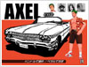
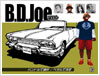
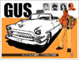

.. _drivers:

游戏角色及其座驾
=====================

本节对每个司机的优势和缺陷进行一个简短的介绍，并给出（公认的）评价。

Axel
-------

优势
+++++++

- 适中的加速/减速
- 适中的操控性

缺陷
+++++++

- 车重较轻
- 车宽较宽

最终裁决
+++++++++++

选择 Axel 的车是一个比较周全的方案。它在几乎所有方面都是“一般的好”，但同时也没有任何你可以发挥到极致的的特殊长处。

出租车的重量较轻，意味着当你和另一辆车相撞的时候，你被撞开、完全转向甚至成为可怕的 :ref:`tele-bug` 的受害者的几率也会更大。较大的车宽会使你在车流中穿行时更容易撞到其它车辆，让前进变得比原本更加困难。

撇开这两个缺陷不谈，既没有特别强烈的动机不去选这辆车，也没有很能令人信服的理由去选择它。虽然我们还有更好的选择，但是这辆车还是可以得到一个\ **差强人意**\ 的评价。

B.D. Joe
----------

优势
+++++++

- 最快的普通极限速度 (Normal Floored Speed)
- 适中的加速/减速
- 较重的车重
- 触发 Crazy Drift 较容易

缺陷
+++++++

- 糟糕的操控性
- 车宽较宽
- 触发 Crazy Drift 过于容易

最终裁决
+++++++++++

这辆车最吸引人的地方就是它的普通极限速度是最快的。问题在于，一旦你学会了如何 :ref:`crazy-dash` 和 :ref:`limiter-cut` ，这种“优势”就被完全抹去了。此时就是你发现问题不对的时候。

这辆车主要的问题是大车宽和糟糕的操作性；它简直是一艘船！在 Limiter Cut 的速度行驶时，在车流中穿梭本来就很困难了，更别说这辆车是这么宽，又这么容易滑动！这使得它太容易触发 Crazy Drift 了（通常是在无意中）。你要做的就是开着一辆快车来回在同一车道前进，当它不小心滑出车道或者撞到别的车流中时，就变成一个大麻烦了（谢天谢地，这辆车还算重！）。

在\ **疯狂出租车**\ 中，车辆之间的“穿针引线”是很重要的，这不仅能增加你的\ :ref:`tip-multiplier`\ ，还能延长你的剩余时间。开着 B.D. Joe 的出租车比其它车都更难这么做；你必须提前背好交通路线才能（勉强）避免紧张的交通状况，而不是试图从里面突围。不幸的是，不是在所有情况下都能这么做。我只建议你在想要挑战/妨碍自己的情况下，或在没有想要拿到最高分的时候再选择这辆车。

顺便说一下，如果这是你使用过的唯一一辆车，你显然就是在把事情变得比原本更困难：不幸的是，绝大多数玩家都会\ **否决**\ 掉这辆车。

Gena
------

优势
+++++++

- 最快的加速/减速
- 最灵敏的操控性
- 最好的刹车
- 车宽较窄

缺陷
+++++++

- 车重较轻
- 在你习惯之前会感觉它的操控性简直过于灵敏了
- 最难触发 Crazy Drift

最终裁决
+++++++++++

Gena 的车拥有所有出租车里面最好的加减速性能。这在它触发 :ref:`crazy-dash` 和 :ref:`limiter-cut` 时是一把双刃剑。因为她的车减速最快，所以你必须比平时更加频繁地触发 Limiter Cut，以避免失去你现在的速度。另一方面，她的出租车停得比其它任何一辆都要快。

另一把双刃剑是它的操控性。由于它惊人的牵引力，它对车轮轻微转动的反应极为灵敏。在你习惯之前，它的转向看起来可能会显得“过于”灵敏。坚持下去，你最终会收获回报。

上面提到的巨大牵引力，也产生了另一个负面后果：它触发 :ref:`crazy-drift` 变得更加困难。你会经常发现出租车在转弯时同时速度也降了下来（尤其是以普通极限速度行驶时）。解决办法是在你没有达到 Crazy Dash 的速度时执行 Granny 的 Crazy Drift 变体。另一件需要记住的事情是这辆车的牵引力让它不能够像其它车一样地触发 Crazy Drifting。

这辆车唯一的不能通过提高驾驶技术来克服的缺点是它的重量太轻，这使得它很容易在高速碰撞后调转方向或成为 :ref:`tele-bug` 的受害者。你要做的就是利用这辆车的高操控性能来尽可能避免这样的碰撞。

熟练的玩家可以用 Gena 的车通过持续触发 Limiter Cuts 来拿到很高的分数（也许是游戏里最高的分数）。只要小心避免车辆碰撞（特别是迎面而来的突发状况），并一直专注于赢得时间奖励，而不是通过 :ref:`crazy-drift` 积攒的\ :ref:`tip-multiplier`\ 。

Gena 的车对于不懂任何特殊技巧的初级玩家来说也是一个很好的选择。由于它出色的加速性能（这在某种程度上弥补了 Crazy Dash 上的缺陷）和刹车性能，玩家将获得比用其他角色更高的分数。所以对于新手和高手，这辆车都能够拿到一个\ **衷心点赞**\ 。

Gus
----

优势
+++++++

- 最好的操控性
- 车宽较窄
- 最重的车重

缺陷
+++++++

- 最慢的加速/减速
- 高速行驶时容易误判停车距离

最终裁决
+++++++++++

Gus 的车是所有车里面最重的一辆，导致它的加减速是最慢的。这听起来有点无聊，但事实上并非如此。一旦你学会了如何 :ref:`crazy-dash` ，慢加速度的问题其实就迎刃而解了。缓慢的减速听起来不太好，但其实这意味着从 Crazy Dash 和 :ref:`limiter-cut` 中获得的速度爆发会持续更久（所以你不需要频繁触发）。

Gena 的车操控更灵活，范围也更大，但是 Gus 的感觉更加自然。这与他的车的窄身结合在一起，非常有助于在拥挤的交通中穿梭。一个熟练的司机可以在长途任务中拿到可观的\ :ref:`tip-multiplier`\ 。

由于它的重量最重，一旦你达到 Limiter Cut的速度，你可以比用其它车的时候更大胆一些。虽然你依然是想为了额外小费而避免撞到大型车辆，但是到了无法避免的时候，对方车辆的偏移将会比你更严重。

Gus 的车的最大问题在于停车。当你送乘客下车时使用 :ref:`crazy-stop` ，你经常会 :ref:`crazy-drift` 到墙壁上，或者撞进一个不太结实的物体上面（热狗车、电话亭等）。拉人上车则是另外一个故事了；唯一的答案就是经验。对于所有的出租车来说，最好都是停在乘客前面的侧方，而不是走过头。开 Gus 的车，你总要小心一点：它的惯性很大。

由于它缓慢的加速度，这款出租车对于没掌握多少技巧的玩家来说可能不是最好的。一旦你可以做 Crazy Dash，事情就会有所好转，但是直到你能熟练进行 Limiter Cuts 才能真正掌控它。（事实上，缓慢的减速可能会让 Limiter Cut 的学习花费更长时间，玩家需要额外的时间区分不同的动作和找到正确的节奏。）因为这款出租车只有一个主要的缺点（可以通过经验来克服），所以它也获得了高手和骨灰级玩家的\ **高度评价**\ 。