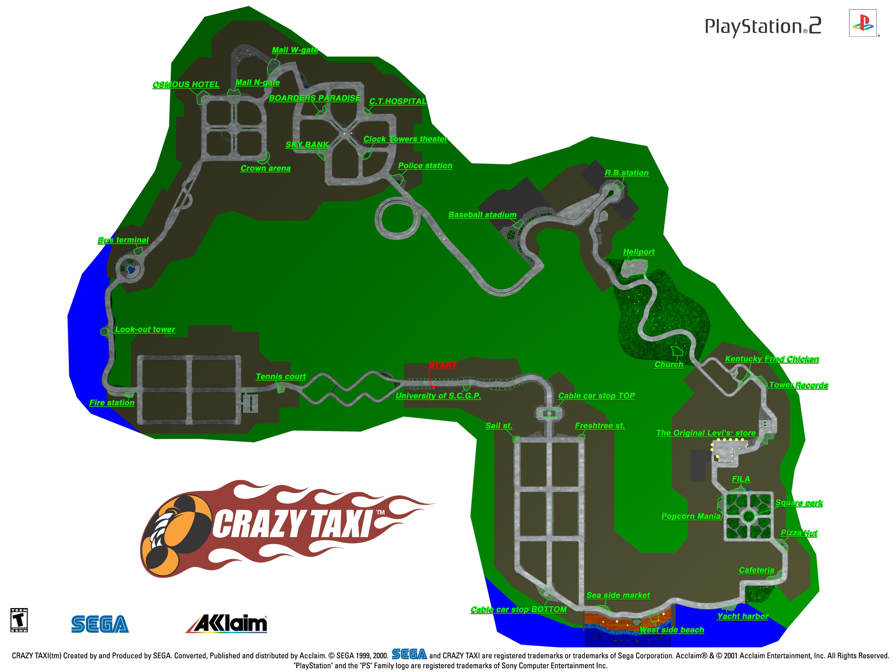

.. _loc-notes:

※ 下车点位置地图
====================

这个页面包含了\ **疯狂出租车**\ 的路线地图，还有游戏中所有地点详情的链接。

路线地图
-------------

这里提供一张 Arcade 的路线地图，高分辨率地图的下载链接\ :download:`点击此处 <./img/CrazyTaxiMap-300dpi.jpg>`\ 。

这张图详细列出了地图路线及所有目的地，但没有给出乘客位置和他们可能要去的目的地。

.. _loc-idx:

地点索引
-------------

点击下面的链接会弹出单独的页面，包含所选位置的具体信息。

.. toctree::
   :maxdepth: 1
   :caption: Locations
   :glob:

   ./loc/loc*

上面的链接不会列出所有乘客的所有可能目的地，相反，它们指出最划算的乘客的颜色，以及在必要时应该尽量避开的乘客颜色。这里要记的东西已经很多了，没必要列出每个可能性来让你不知所措。

地图是用 ASCII 字符实现的，因此可以把每个页面保存为文本文件（不只是 html）。通过这种方式，信息可以被整合到你的文本编辑器（或者文字处理系统，在你使用等宽字体如 courier 时）里面，以供查看或打印，而不用考虑任何图形处理的开销。