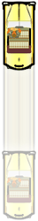
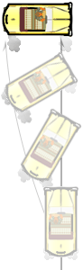
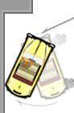

.. _5-skills:

※ 你必须知道的 5 个获胜技巧
==============================

以下是一些基本的驾驶技巧，在一般游戏中你会有 95% 的时间都在用它们。你掌握得越熟练，在游戏中的表现也会越好，这一点我可以保证！让我们从最简单的开始，一直到最难的。

.. _crazy-dash:

Crazy Dash
----------------

- (from full stop, very slow speed, or normal floored speed)
- **Drive > Floor Gas Pedal**

.. note::

   在本节中，你可以发现提及到了所谓的“普通极限速度” (Normal Floored Speed)，即在你踩下油门并且除了转向外什么也不做时，你的出租车的速度。稍后，你会发现这个速度跟真正能达到的速度比起来只是小巫见大巫...

如何触发？
+++++++++++

这个动作可以在你的座驾处于静止、缓慢移动或“普通极限速度”时完成。它包括了两个紧密衔接的动作，就像一套组合拳。具体操作如下：

1. 把挡位 (gearshift) 从空挡或倒退调到前进 (Drive)。（我一般会摁住前进挡不放手。）
2. 第一步完成后立即踩油门 (Floor Gas Pedal)。

如果你同时调整挡位和踩油门，会导致触发失败；两个动作必须一个接一个进行，中间要稍微停顿一下。你可以大喊一声 "taxi"（这听起来有些奇怪，但请相信我），这样，触发 Crazy Dash 的时机就可以安排如下：

.. list-table::
    :align: center

    * - tak
      - \-
      - zee
    * - **Drive**
      - **>**
      - **Floor Gas Pedal**

如何判断是否正确触发？
++++++++++++++++++++++++

当你从静止状态开始触发 Crazy Dash 时，你的座驾不会像平时那样慢慢加速——所有的能量好像都转化为了轮子的牵引力——你的出租车会在很短的一段时间内以比普通极限速度快得多的速度呼啸而去。

注意事项
++++++++++++

很高兴你会问这个！这里有一些额外的要点。

- 这个动作可以在乘客上下车的动画中就开始“缓冲”，在他们开始爬进车或下车脚刚触碰地面时的时候，就可以进行 Crazy Dash 了。动画结束后招式就会自动开启，为你节省宝贵的时间。

- 在执行这个招式时，不要一直向左或向右转动方向盘。如果你这么做了，你可能会触发另一个不同的招式，那就是 :ref:`crazy-turn`\ 。如果你想在 Crazy Dash 时转向，等看到你的出租车开始前进后再转方向盘。

- 如果你把 Crazy Dash 搞砸了，你的车停着不动，赶快把脚从油门上移开，让挡位回到空挡的位置，然后再试一次。在缓慢移动到普通极限速度之间有一个“死区”，在此期间，你不能触发这个招式。这就是为什么你最好把脚先移开再重新试一次。

- 这个招式最大的好处就是他能带来更高的速度，这一点在你看到下面的 :ref:`limiter-cut` 时会理解更深刻。

- 如果你碰巧选了\ :ref:`自行车 <bicycle>`\ 作为自己的座驾，还有一个额外的惊喜。当你从静止状态开始 Crazy Dash 时，屏幕偶尔会保持在一个固定的位置，而自行车则快速地与视线拉开距离，变得越来越小。一两秒钟后，屏幕将再次“赶上”。由于种种原因，我对自行车并不是很感冒，但我必须承认，这种效果是非常拉风的。

.. _crazy-stop:

Crazy Stop
----------------

- (while driving forward)
- **Reverse > Hold Brake**

如何触发？
+++++++++++

很显然，它只有在你正在移动的情况下才能被触发。就像 Crazy Dash，它包括了两个紧密衔接的动作：

1. 将挡位从前进或空挡调整到后退 (Reverse)（如果你愿意也可以踩着油门不放开）。
2. 按下刹车踏板 (Brake Pedal) 不要放。

如何判断是否正确触发？
++++++++++++++++++++++++

你的出租车会比单独使用刹车时更快停下来，没有必要进行任何具体比较，相信我，好吗？

注意事项
++++++++++++

有一个小的技术细节...

- 这不是真正的 Crazy Stop（但确实有效，尽情用它吧！）。“官方”定义下的该招式见\ :ref:`add-skills`\ 页面。

.. _crazy-drift:

Crazy Drift
----------------

- (while driving forward)
- **Hold Brake > Reverse > Drive > Turn Wheel**

如何触发？
+++++++++++

这个招式必须在你的出租车移动时进行。它包括了以下几个紧密衔接的动作 (基础版本，又称 Braking Crazy Drift)：

1. 踩着刹车踏板 (Brake Pedal) 不要放。
2. 把挡位调到后退 (Reverse)。
3. 把挡位调到前进 (Drive)。
4. 向左或向右猛打方向。

如何判断是否正确触发？
++++++++++++++++++++++++

当你进行 Crazy Drift 时，你的出租车会在屏幕上侧翻并打滑。如果你转弯足够急，那么你会触发一个 Crazy Drift Combo，不断增加小费金额到你的计价表中，直到车停止打滑。

这个招式是游戏中最灵活的动作。除了在最后附带一个特定的动作外，它还有好几种变化模式。我自己在送乘客到目的地时大约 95% 的时间里都在使用 Braking Crazy Drift，理由如下：

- 在 Crazy Drift 的整个阶段踩住刹车不要放可以防止你的车偏离航向。就像前面的图示展现的那样，车辆的前部将保持在目标位置，而后部则向相反的方向旋转。你可以在交通状况比较好的时候用这个技巧来制造非常长的 Crazy Drift Combo，而不必担心错过你的目的地。

- 与该招式的其它变体不同的是，Braking Crazy Drift 可以在 Limiter Cut 产生的速度爆发之后不久就触发。其它技能都只能在 Limiter Cut 的速度开始下降后才能触发。

- 如果目的地是靠墙的，而且时间不多了，那就去触发 Braking Crazy Drift吧，但是要给自己留一点时间，保证你旋转得足够多，车后角能够撞到墙，这可以确保你不会成为 :ref:`wall-stick` 的受害者。

这个招式有几个变体：

:Non-Braking Crazy Drift:

要触发这个变体，简单地将踩刹车踏板的步骤去掉就好了 (**Reverse > Drive > Turn Wheel**)。

与前面的 Braking Crazy Drift 不同，你的车在打滑的时候不会继续在一条直线上行驶。它会在你转弯的方向继续滑动相当长的距离。换句话说，在打滑的过程中，与车身同一直线的方向上也有一定的牵引力存在。在一个 Non-Braking Crazy Drift 之后连击（或按住）刹车踏板会导致你的车继续在打滑的方向前进，但相比之下会少去之前的“前进的牵引力”。

:Granny's Crazy Drift:

这是其它一些\ **疯狂出租车**\ 网站大力推荐的 Crazy Drift 版本。它基于这样一种信念（在一些老司机中比较流行），即“在右转之前先向左转一点”总是好的。

要做这个版本的 Crazy Drift，在你转换挡位 (Reverse > Drive) 准备打滑时，先超反方向稍微偏一点，然后朝你希望的方向用力转向，并连击或按住刹车踏板 (**Turn Wheel > Brake**)。

这个版本的招式确实有一定的优势：你在打滑中获得了一点额外的速度， Crazy Drift Combo 也来得早一点（Combo 中的点数也能积累得更快一点）。坏消息是，走过的路程长了，但是你对车的控制能力却下降了，有时当这个动作太靠近墙壁或其它物体时，所获得的额外速度也会导致不好的后果 (\ :ref:`wall-stick` 或 :ref:`imp-bou`\ )。当你位于一个比较大的落客区，而它后面是一堵墙，并且中间没有任何障碍物，你可能会想到用这个招式。

注意事项
++++++++++++

当然有！

- 在你打滑时，你可以在\ **踩刹车**\ 的同时\ **换挡**\ 。如果车快滑到头了，它会突然停下来“站稳”。然而，如果你滑得太快，出租车会在一瞬间脱离地面，然后继续以同样的速度向同一个方向滑行（在这个过程中通常会重置额外奖励的计数）。

- 你可以在不转方向盘的情况下实现 Braking Crazy Drift。这在接乘客上车的时候其实是一个很好的技巧。当你快滑完时，你仍然可以通过换挡到\ **后退**\ 来调整你的车，这样可以防止你不小心滑过了乘客的位置。由于某些原因，当你使用这个技巧的时候，乘客也会更大但一些；他们不会像以前一样经常反应过度。

- 在你打滑的时候，你可以做一个 :ref:`crazy-dash` 或者 :ref:`limiter-cut`\ （尽管Crazy Dash 要容易得多），这样做会让你的出租车朝它此时正面向的任意方向冲刺。这对拐弯角度比较大的街角很有效；早点做一个 Braking Crazy Drift，把车头转到街的方向，赚点小费，然后在新方向 Crazy Dash！只是不要过早地碰到任何东西，否则你会发现自己转弯撞到了墙上，而不是街道的正中央。

.. _crazy-tailspin:

Crazy Tailspin
-----------------

- (just before cab completely stops after Crazy Drift)
- **Turn Wheel > Release Brake & Press Gas Pedal > Drive > Release Gas Pedal**

如何触发？
+++++++++++

在你的出租车完全停下来之前（通常是在接近 Crazy Drift 的终点时），你可以通过以下操作实现一个类似 :ref:`crazy-turn` 的动作：

1. 向左或向右转。
2. 松开刹车 (Brake)，踩下油门踏板 (Gas Pedal)。
3. （如果必要的话）把挡位调整至前进 (Drive)。
4. 等你的车朝向你想要的方向时松开油门 (Gas Pedal)。

如何判断是否正确触发？
++++++++++++++++++++++++

车前部被锚定在固定的位置，后部绕其旋转。转动的程度取决于你转动方向的程度和踩着油门的时间。

注意事项
++++++++++++

当然有！

- 正如你从上图所看到的，Crazy Tailspin 对于最大化你的游戏时间是不可获取的。如果这里使用 Crazy Drift，稍后的 Crazy Dash 会把车冲到角落里面。Crazy Tailspin 使你避免了这种浪费时间的处境。

- 你可以在你的车快要完全停稳的时候做这个动作；在 Crazy Drift 之后这个招式是非常容易被触发的。例如，你可能在一个 Crazy Stop 中撞了一个电话亭，让你的车（几乎）停了下来，在此之后你可以做一个 Crazy Tailspin 来调整到一个更好的姿势，去接下一个乘客。

- 在 Crazy Tailspin 的过程中，你的出租车的旋转速度大约是 :ref:`crazy-turn` 速度的两倍。因此，你唯一会选择 Crazy Turn 而不是 Crazy Tailspin 的场景是在你到了一个乘客的目的地，但是时间太紧张，以致 Crazy Tailspin 可能会让你失去奖励的 5 秒或 2 秒的时候。否则，在停车之前用 Crazy Tailspin 调整到一个更好的方向总是更有利的；特别是在你接乘客的时候，毕竟以 Crazy Turn 开场会降低你拿到更多分数的机会。

- 乘客站在你车前面时会感到害怕，如果你直接朝他们开过去，他们往往会跳着逃开。然而，如果你用这个招式停在他们旁边，他们就不会跑开了。事实上，你的车可以旋转着穿过乘客（甚至就停在他们身上），他们仍然会站在原地。在许多情况下，你可以借助这个事实来缩短乘客上车的距离，这将使你的驾驶时间最优化，增加你成功地拿到额外时间奖励的机会。

.. _limiter-cut:

Limiter Cut
-----------------

- (after Crazy Dash)
- **Unfloor Gas Pedal > Reverse > Drive > Floor Gas Pedal**

如何触发？
+++++++++++

这个动作必须在 Crazy Dash 之后、车速降到普通极限速度之前完成。可以简单地把它分成两部分动作，每个部分之间可以稍作停顿。

1. 通过“松开”油门 (Gas Pedal) 来减速。
2. 挡位调至后退 (Reverse)。（对我来说，调完后就按着不放对我的操作有一定的帮助。）
3. [可选的停顿] 我认为这个停顿比半秒长不了多少，否则你的车会减速太多，导致无法触发 Limiter Cut。
4. 把挡位调到前进 (Drive)。（我还是调完后按着不放）
5. 油门 (Gas Pedal) 踩到底。

所以，第一部分是一个“逆 Crazy Dash”（以 Crazy Dash 的计时来执行），第二部分是一个 Crazy Dash。这里有一个计时口诀：

.. list-table::
    :align: center

    * - cray
      - \-
      - zee
      - *...*
      - tak
      - zee
    * - **Unfloor Gas Pedal**
      - **>**
      - **Reverse**
      - *optional short pause (.5 sec or less)*
      - **Drive**
      - **Floor Gas Pedal**

**世嘉** (Sega) 在游戏名字中就藏了计时口诀，有趣吧？:) 如果有\ **街头霸王** (Street Fighter) 玩家用过 Guile，可以这么记—— **Unfloor Gas Pedal > Reverse** 部分就像你开始装填 Guile 的 Sonic Boom，**Drive > Floor Gas Pedal** 部分就像你发射它。一旦你可以持续做这个动作，就把精力集中在缩短两部分之间的停顿中吧。

如何判断是否正确触发？
++++++++++++++++++++++++

你的车在 Crazy Drift 之后会跑得很快，但是在 Limiter Cut 之后，它甚至能跑得更快！其它表明你成功的迹象包括汽车后面的保险杠有一个瞬间的下降、轮胎和发动机发出一声微弱的啸叫和轰鸣声（可能很难听到，取决于音乐和背景噪音）、还有急剧加速时漫画式的画面效果。

注意事项
++++++++++++

有！

- 就像你可以通过在 Crazy Dash 的加速结束前实现 Limiter Cut 来获得额外的速度，你可以通过在前一个 Limiter Cut 的加速结束前触发下一个加速！因此，在 Crazy Dash 之后可以触发多个 Limiter Cuts，每一个都会让你的出租车跑得越来越快。

你的目标是让 Limiter Cut成为一种常规的、自动的招式，让你几乎一直以那么快的速度移动！往死里练这个招式吧；一旦你能够持续触发它（并且仍然保持对出租车的控制），汇报将是巨大的！达到这一点之后，你将在一个完全不同的水平上玩\ **疯狂出租车**\ 。

.. warning::

    一旦你习惯了 LC3+ 的速度，再去看菜鸟玩家就会像看慢镜头的足球比赛回放。你甚至可能会变得有些烦躁；别说我没警告过你。

- 为什么我会说“松开”油门？

在\ **疯狂出租车**\ 里面，油门有一个\ :ref:`最大值 <gas-padel-max>`\ ，通常是通过在一路上都把踏板压住来触发的。如果你稍微松开踏板，即使离地面只有半英寸，这个最大值也不会被触发。在做 Crazy Dash（或 Limiter Cut 的 Crazy Dash 部分）的时候，至关重要的是踏板要向下推得足够远，以触发最高速度。然而，在 Limiter Cut 的前半部分 (**Unfloor Gas Pedal > Reverse**) 你只需要把脚从油门上抬起足够的距离，使最大速度不被触发；在大多数机器上，没有必要完全松开油门。

虽然你完全放开油门 Limiter Cut 也依然有效，但是如果你是在一个街机出租车模拟器中玩耍，这会是一个很坏的习惯。一开始你可能不会有任何问题，但随着你越来越熟练地使用 Limiter Cut，并且在游戏中表现越来越好，你的游戏时间会大大延长。对我来说，一场游戏平均花费 1 小时 40 分钟。我甚至猜不出会有多少次 Limiter Cut... 所以，如果你总是在 Limiter Cut 的过程中完全放开油门又把它踩死回去，我要很不幸地告诉你... 你越进步，你越会满头大汗！因此，学习以尽可能少的努力来触发 Limiter Cut 是很有必要的。从长远来看，这对你自己和对游戏都是很有益的。

- 注意：如果你完全不能触发 Crazy Dashes 或 Limiter Cuts，你可能需要一个游戏技术人员来帮你\ :ref:`调整机器设置 <gas-padel-max>`\ 。